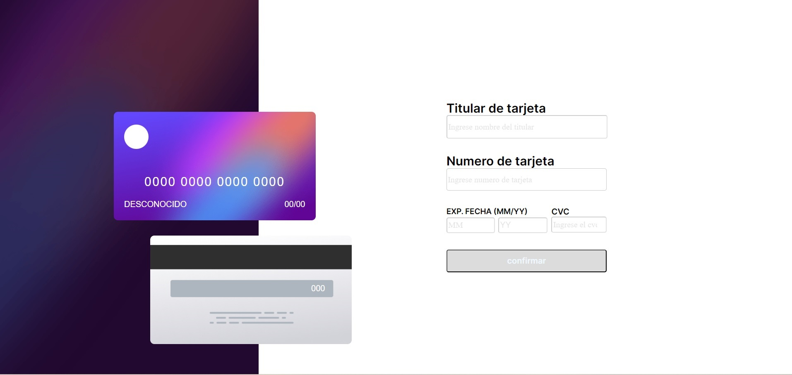

## Descripción general

### The challenge

Los usuarios deberían poder:

- Complete el formulario y vea la actualización de los detalles de la tarjeta en tiempo real
- Recibir mensajes de error cuando se envíe el formulario si:
- Cualquier campo de entrada está vacío
- Los campos número de tarjeta, fecha de caducidad o CVC tienen el formato incorrecto
- Ver el diseño óptimo según el tamaño de pantalla de su dispositivo
- Ver estados de desplazamiento, activo y de enfoque para elementos interactivos en la página

### Screenshot

### Links

- Solucion URL: [Link del repositorio](https://github.com/Pedro-ETS/card-details-form.git)
- Live Site URL: [Link del proyecto](https://card-details-form-sigma.vercel.app/)

### Built with
- Vite
- HTML5
- SCSS
- [React](https://reactjs.org/) - Biblioteca JS

### What I learned
Aprendí a utilizar SCSS para estilizar el proyecto, lo que permitió que la apariencia fuera tanto atractiva como coherente. SCSS facilitó la escritura de estilos de manera más eficiente y mantenible, gracias a sus características avanzadas como variables, anidamiento y mixins. Además, reforcé mis conocimientos en React, mejorando mi habilidad para construir interfaces de usuario interactivas y modulares.

### Continued development

En futuros proyectos, tengo la intención de utilizar Next.js para el desarrollo de aplicaciones web, Axios para gestionar las solicitudes HTTP, y Taldwin para optimizar la gestión de datos y mejorar la eficiencia general del proyecto.